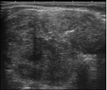
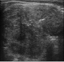
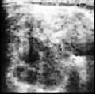
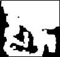
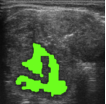

# Thyroid Nodule Detection with Image Processing Pipeline

This project demonstrates an automated method for detecting and analyzing thyroid nodules from ultrasound images. The pipeline consists of multiple image processing steps, including noise reduction, morphological operations, edge detection, thresholding, and texture feature extraction.

## Table of Contents
- [Introduction](#introduction)
- [Features](#features)
- [Requirements](#requirements)
- [Installation](#installation)
- [Usage](#usage)
- [Pipeline Steps](#pipeline-steps)
- [Examples](#examples)
- [Feature Extraction](#feature-extraction)
- [License](#license)

## Introduction

This project aims to detect thyroid nodules using various image processing techniques. The steps include filtering, segmentation, and feature extraction, helping radiologists or researchers analyze the nodules for potential anomalies.

## Features
- **Noise Reduction**: Gaussian blur is applied to reduce noise from ultrasound images.
- **Morphological Operations**: Erosion and dilation are used to highlight the regions of interest (ROIs).
- **Edge Detection**: Canny edge detection is used to preserve the edges.
- **Image Enhancement**: Histogram equalization is used to enhance the image contrast.
- **Thresholding**: Otsu's thresholding is used for optimal image segmentation.
- **Texture Analysis**: Grey Level Co-occurrence Matrix (GLCM) method is applied for texture feature extraction.
- **ROI Extraction and Visualization**: ROIs are extracted, and their contours are visualized.

## Requirements

Ensure you have the following Python libraries installed:
```bash
opencv-python
numpy
matplotlib
scikit-image
scipy
```

You can install the dependencies with:
```bash
pip install opencv-python numpy matplotlib scikit-image scipy
```

## Installation

Clone this repository and navigate into the folder:
```bash
git clone https://github.com/your_username/thyroid-nodule-detection.git
cd thyroid-nodule-detection
```

## Usage

Place the ultrasound image in a directory and adjust the `image_path` in the `main()` function. Then run the script:

```bash
python nodule_detection.py
```

This will output processed images at each stage of the pipeline and display results including regions of interest (ROIs) and texture features.

## Pipeline Steps

The image processing pipeline consists of the following steps:

1. **Noise Reduction (Gaussian Blur)**  
   Reduces noise and smooths the image.
   ```python
   blurred_image = gausian_blur(image)
   ```

2. **Morphological Operations**  
   Perform erosion followed by dilation to eliminate noise and highlight the regions of interest.
   ```python
   opened_image = morphological_opening(blurred_image)
   ```

3. **Edge Preservation (Canny Edge Detection)**  
   Detects edges in the image.
   ```python
   edges = edge_preservation(opened_image)
   ```

4. **Image Enhancement (Histogram Equalization)**  
   Enhances the contrast of the image.
   ```python
   enhanced_image = image_enhancement(opened_image)
   ```

5. **Optimal Thresholding (Otsu's Method)**  
   Segments the image into binary regions.
   ```python
   otsu_thresholded = otsu_thresholding(enhanced_image)
   ```

6. **Region of Interest Extraction**  
   Extracts contours based on size to identify potential nodules.
   ```python
   rois = extract_rois(otsu_thresholded)
   ```

7. **Contour Filling and Visualization**  
   Visualizes detected ROIs by filling them with green color and saving the result.
   ```python
   fill_contours(output_image, rois)
   ```

8. **ROI Visualization**  
   ROIs are cut and saved to another folder.
   ```python
   visualize_rois(image, rois)
   ```

## Examples

Here’s a breakdown of the steps using an example ultrasound image:

- **Original Image**  
  
  
- **Morphological Opening**  
  
  
- **Canny Edges**  
  
  
- **Enhanced Image**  
  
  
- **Otsu Thresholding**  
  
  
- **Detected Nodules**  
  

## Feature Extraction

The program also extracts texture features using the Grey Level Co-occurrence Matrix (GLCM) method. These features include:

- **Contrast**
- **Dissimilarity**
- **Homogeneity**
- **Energy**
- **Correlation**

The extracted features help analyze the texture properties of the detected regions of interest.

## License

This project is licensed under the MIT License - see the [LICENSE](LICENSE) file for details.
